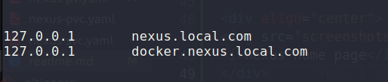
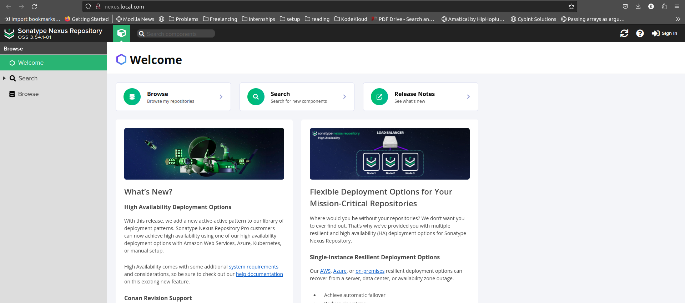
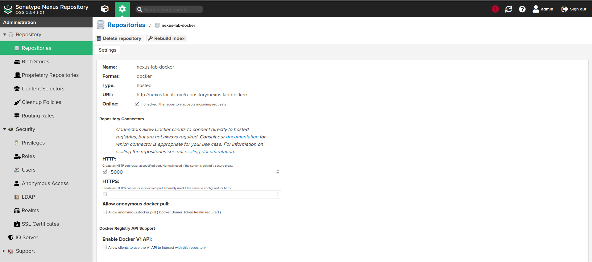
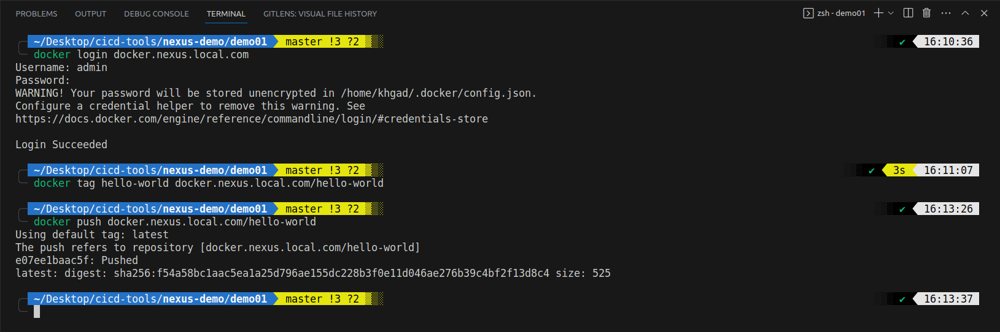
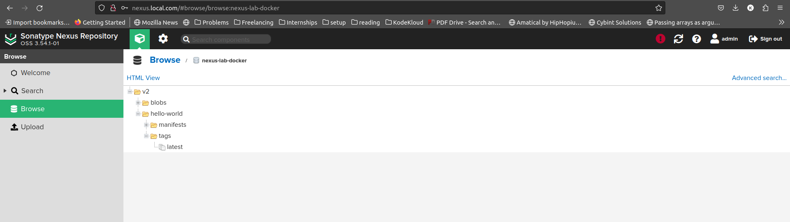

# Applying Sonatype Nexus as a Deployment

> [Sontype Nexus](https://hub.docker.com/r/sonatype/nexus3/) docker image
> I am using docker desktop


## 1.1 Deploy `nexus` k8s resources:

> Deploy `nexus` [ns](./nexus-ns.yaml)

```
kubectl apply -f nexus-ns.yaml
```

> Deploy `nexus` [pv](./nexus-pv.yaml)

```
kubectl apply -f nexus-pv.yaml
```
> Deploy `nexus` [pvc](./nexus-pvc.yaml)

```
kubectl apply -f nexus-pvc.yaml
```
> Deploy `nexus` [svc](./nexus-svc.yaml)

```
kubectl apply -f nexus-svc.yaml
```
> Deploy `nexus` [deployment](./nexus-deploy.yaml)

```
kubectl apply -f nexus-deploy.yaml
```
> Deploy `nexus` [Ingress](./nexus-ingress.yaml)

```
kubectl apply -f nexus-ingress.yaml
```

> Add nexus.local.com and docker.nexus.local.com to `/etc/hosts`

```
sudo vi /etc/hosts
```
note: if you use minikube then use `<minikube_ip>` instead of `127.0.0.1`
<div align="center">
<br>
<i>hosts</i>
</div>

> go to http://nexus.local.com

<div align="center">

<i>nexus home page</i>
</div>


## 1.2 use docker repository in nexus

> create new docker repository of type hosted and set port to `5000`

<div align="center">

<i>new docker repository</i>
</div>

> enable insecure registiry:
```
sudo vi /etc/docker/daemon.json

# paste below content:
{
  "insecure-registries" : ["docker.nexus.local.com"]
}

sudo systemctl restart docker
```
<div align="center">

<i>docker push process</i>
</div>

<div align="center">

<i>verify that image has been pushed to nexus</i>
</div>